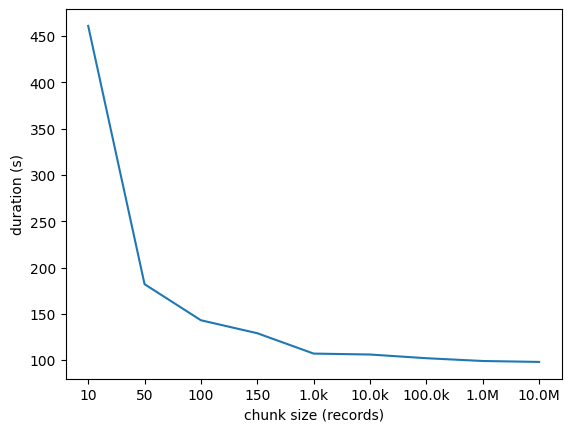
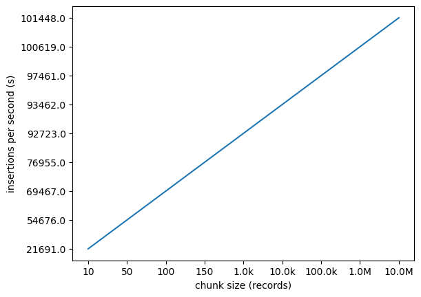

# Documentation
This is a simple script for 
1. generating 10 Million random 7-character tokens.
2. Inserting these tokens into a relational database and saving the frequency of each token if duplicates exist.

for generating the tokens a simple python script was used that samples the tokens from a uniform probability distribution.

for storing the tokens, first identifying the duplicates was considered, several approaches were considered that included using the database but these have proved to slow down the process of inserting the records in the table considerably an requires more disk I/O operations . in the end it was found that simply running a script to find the duplicates was much faster, two approaches were used, they both included sorting the list which would take approximately O(nlogn) time, there was not a significant increase in performance between them.

for insertion in the database batch insertions were chosen to optimize for disk I/O operations as well as time, as one disk write per insertion would consume considerable disk I/O (10M) which also drastically increases the time taken to do the inserts.
below are graphs of the time taken to insert all the records in the database and insertions per second against the batch size it was found that the the higher the batch number the better the results.

There are some additional scripts for helpers.


### Database Schema
Table tokens
{
    token : string,
    frequency : integer 
}
### Stack
* python 3.8.9
* sqlite3 3.24.0

## Environment
To setup the virtual environment download python3 and virtualenv and run
```
$ virualenv d4l
$ source d4l/bin/activate
$ pip install -r requirements.txt
```
to deactivate the virual environment later run 
```
$ deactivate
```


## Running the scripts

### Generating the tokens
for generating the token run
```
$ python generate_tokens.py
```

### Saving the tokens
for saving thet tokens run
```
$ python save_tokens.py
```


